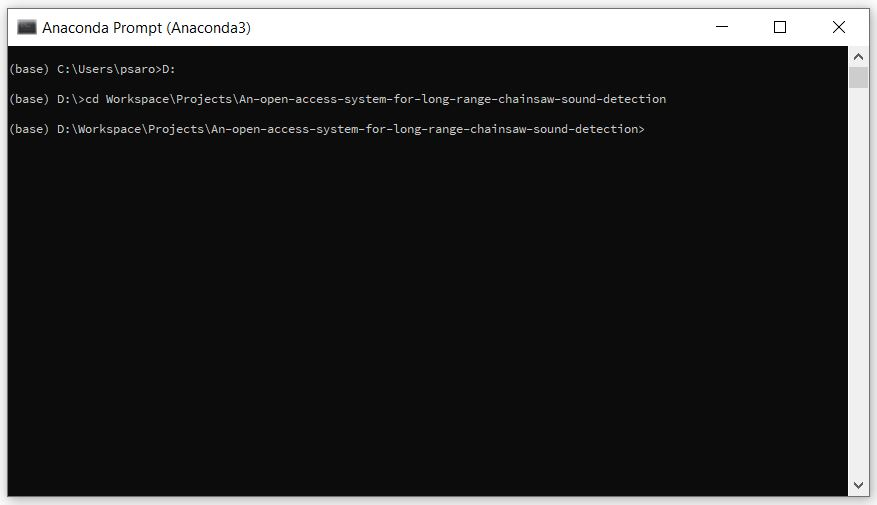
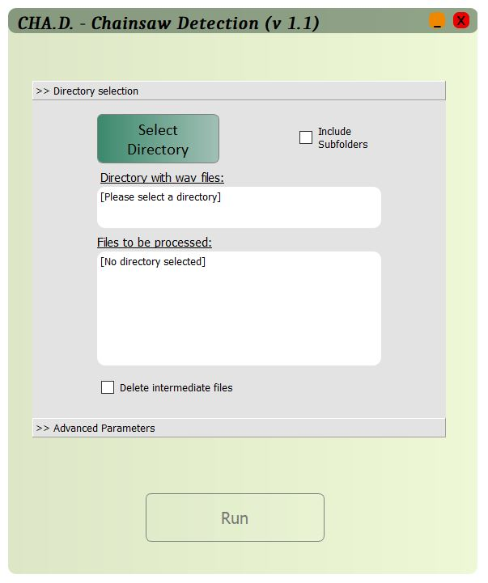
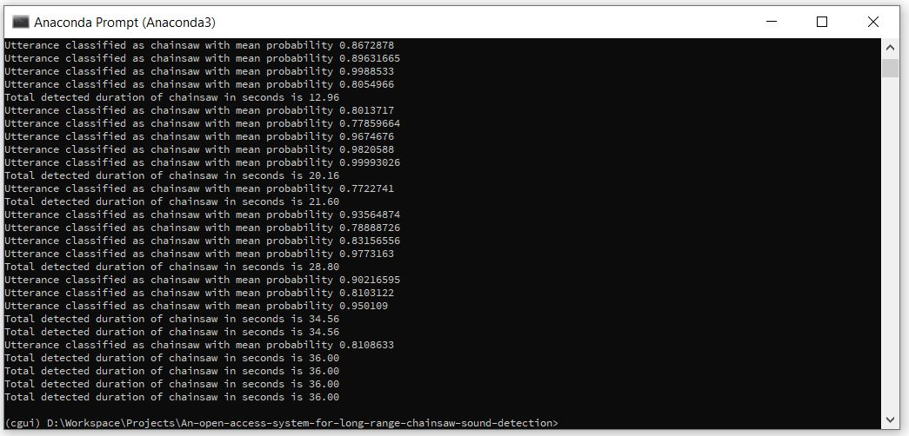
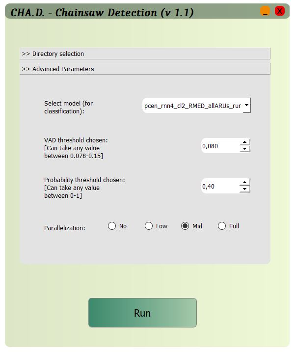
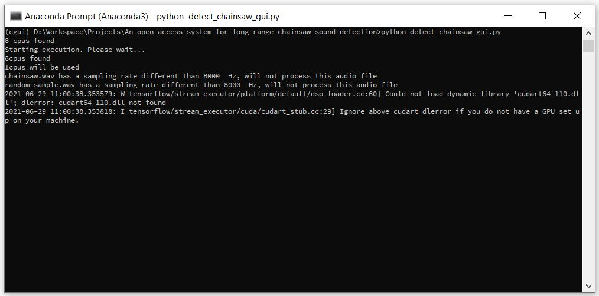
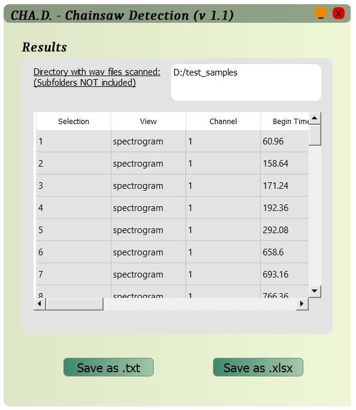
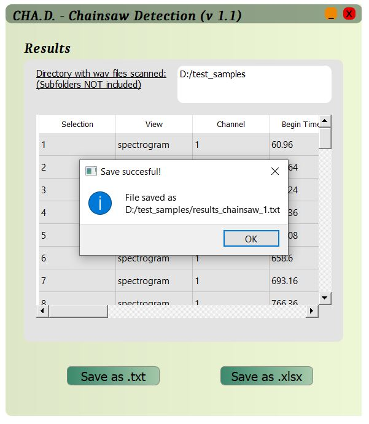
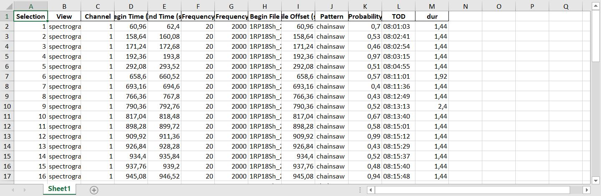
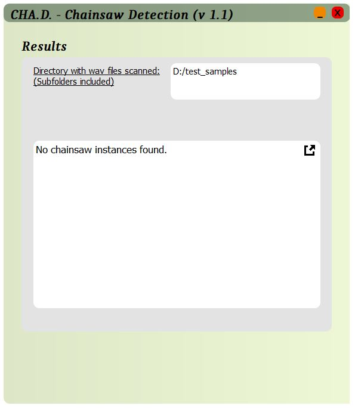

# An open access system for long-range chainsaw sound detection
 **Nikolaos Stefanakis¹², Konstantinos Psaroulakis¹, Nikonas Simou¹, Christos Astaras³**
> **¹** FORTH-ICS, Heraklion, Crete, Greece, GR-70013
>
> **²** Hellenic Mediterranean University, Department of Music Technology and Acoustics, Rethymno, Greece, GR-74100
> 
> **³** Forest Research Institute, Hellenic Agricultural Organization ”Demeter”, 57006 Vasilika, Thessaloniki
-----
## Initial setup 
1) Extract the folder containing the source files in any directory of your hard drive.
2) Install [anaconda], by downloading the installer from the official website. (e.g. Anaconda3-2020.02-Windows-x86_64.exe).
After installation, "anaconda prompt" will show up in the program list.
3) Open anaconda prompt and navigate to the folder which contains the code. (e.g. by typing "cd D:/MyDocuments/viopar/code_copy_20200608")
        
	
	
4) In Anaconda prompt type:
    ```sh
    pip install -r requirements.txt
    ```
​    in order to install all required libraries.
​    This might take some time but it is important for this procedure to be completed successfully.
-----
## Running the algorithm on your data
The system should be ready to run by now. You can run the tool by calling "detect_chainsaw.py" function for the command line version or "detect_chainsaw_gui.py" for the GUI version.

1) Open anaconda prompt and navigate to the source code.




2)  1) Run the command line version by passing as argument the path of the folder which contains the recordings to be analyzed.
For example, if the path is "D:/test_samples", then we can simply type (in anaconda prompt):
    ```sh
    python detect_chainsaw.py D:/test_samples
    ```


* The path of the folder which contains the recordings is the only mandatory input argument.
* Additional input parameters can be given as follows;
    * The **VAD threshold value**,  which determines in a way the "sensitivity" of the algorithm.  We can alter the VAD threshold by typing the following command
        ```py
        python detect_chainsaw.py D:/test_samples 0 -t xxx
        ```
        where xxx is the desired value. The default value is 0.08. Furthermore, the minimum acceptable value is 0.078 and there is no upper limit. However, very high values of the threshold will not trigger any detections
    * **Number of CPUs** to be used. For example, if we want to engage 4 CPUs, we can type:
        ```py
        python detect_chainsaw.py D:/test_samples -u 4
        ```
    * **Classifier's probability threshold**. For example, if we want to set a probability threshold equal to 0.5, we can type:
        
        ```py
        python detect_chainsaw.py D:/test_samples -p 0.5
        ```
        The default value of the probability threshold is 0.75.
    
* After waiting an amount of time a proportionate to the number of input files, execution will be completed and you will see results printed in anaconda prompt. If you finished the analysis, you can quit anaconda prompt. 

 


2) Run the graphical version of the tool by running: 
		``` sh
		python detect_chainsaw_gui.py
		```	


 
	

* Click «Select directory» to choose the directory which contains the input files for the algorithm. A file dialog will open and you can navigate through your drives to find desired folder. You can include subfolders by checking "Include Subfolders" box.

* After choosing the desired directory, .wav files that are going to be processed will appear in the text box  «Files to be processed» and button "Run" will be activated. In case you have selected wrong directory, you can change by clicking «Change directory». You can also choose the number of threads to be used for the execution.

* Before clicking "Run", you can check the box "Delete intermediate files" to delete features extracted during the analysis. However if you keep these intermediate files, you can repeat analysis without changing vad threshold (changing only probability threshold) much faster, since features of audio files would be already extracted. 

   

- Click on "Advanced Parameters" to expand the tab for the configuration of the algorithm.

  

  

* After clicking "Run", GUI will disappear and execution continues on command prompt.

	 -->

* When execution finishes, GUI will appear again presenting the results. 

  

  

* If you click "Save as .txt", "Save as .xlsx", current showing results will be saved in the corresponding filetype and a message with the directory and the filename of the saved file will pop up.

   

* An example of an excel file exported through the tool:

  

  

* In case the following screen appeared after execution of the tool, no chainsaw segments were detected through the analysis.

	


-----
## OUTPUT (what kind of files are created at the end of the analysis)
In both command line and GUI version of the tool, the output files are the same.
Throughout analysis, two folders are created inside the primary folder; 1) A "features" folder, which consists of the acoustic features that are necessary
for classification. 2) An "extracted_segments" folder, which consists of the acoustic segments that are classified as chainsaw by the algorithm. The naming convention reflects the temporal location of each segment and the corresponding `chainsaw` class probability

In the case of the GUI version, depending on user choices in the last step, output files could be more (e.g. one .xlsx or one (raven compatible) .txt file presenting the results)

--------

#### Important notes:
1) Tool accepts recordings with Sampling rate = 8kHz.

2) Tool only looks for `.wav` files inside the target folder without searching any subfolders.

3) Currently, the algorithm is capable of detecting chainsaw sounds only.

4) For long-duration recordings, the tool is configured to utilize many CPUs at the same time.

5) Two environment configurations where the current version of the system was tested are included in the project folder as "tested_environment_1.txt" and "tested_environment_2.txt". You can refer to them for any error you face regarding the libraries.

6) In case of any notice/ideas/proposals/issues regarding the system, you can open an issue in the project or contact us directly.

[anaconda]: <https://anaconda.org/>

-----

## License
MIT 

Copyright (c) 2021 **Nikolaos Stefanakis, Konstantinos Psaroulakis, Nikonas Simou, Christos Astaras**


-----

## How to reference
If you find any of this library useful for your research please cite as:

N. Stefanakis, K. Psaroulakis, N. Simou and C. Astaras, "An open access system for long-range chainsaw sound detection".  

-----

## Disclaimer

Neither the name of FORTH-ICS, Department of Music Technology and Acoustics, Hellenic Mediterranean University, Forest Research Institute, Hellenic Agricultural Organization ”Demeter”, nor the names of its contributors may be used to endorse or promote products derived from this software without specific prior written permission.
